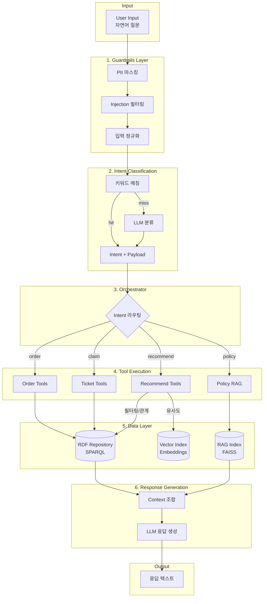
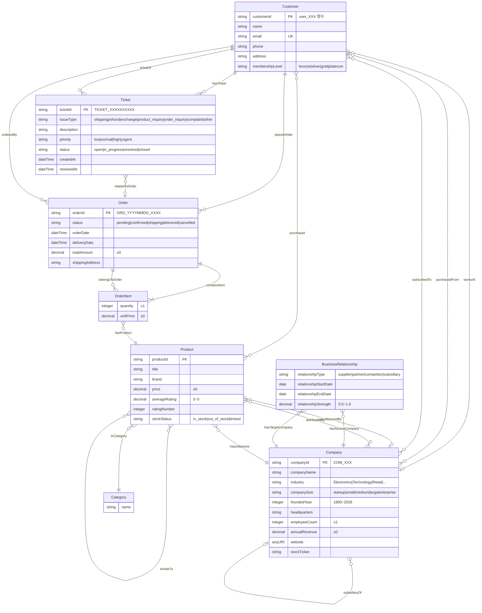
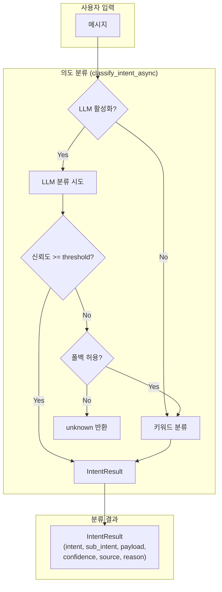
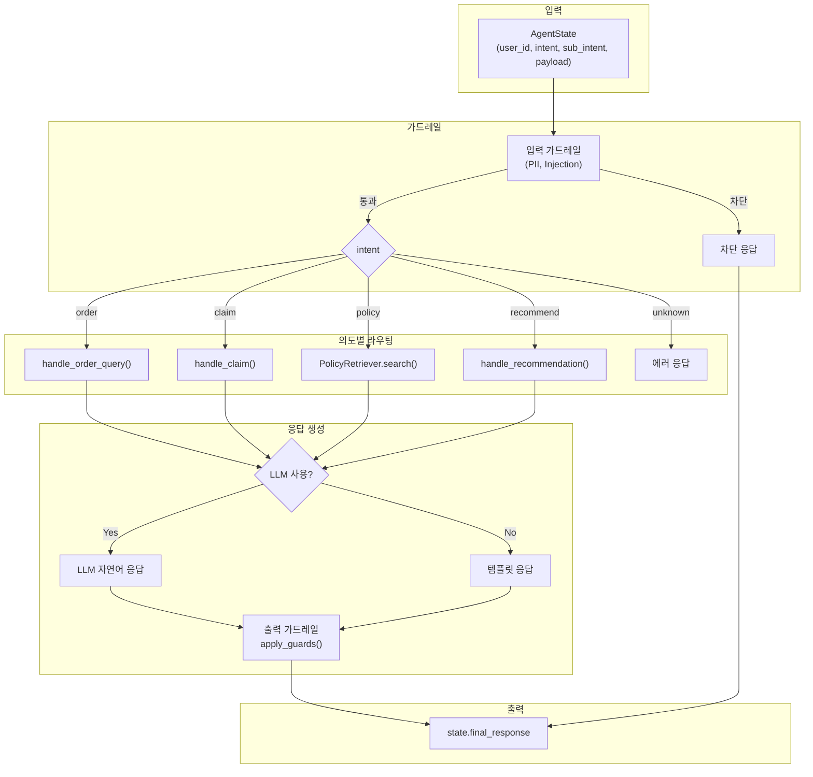
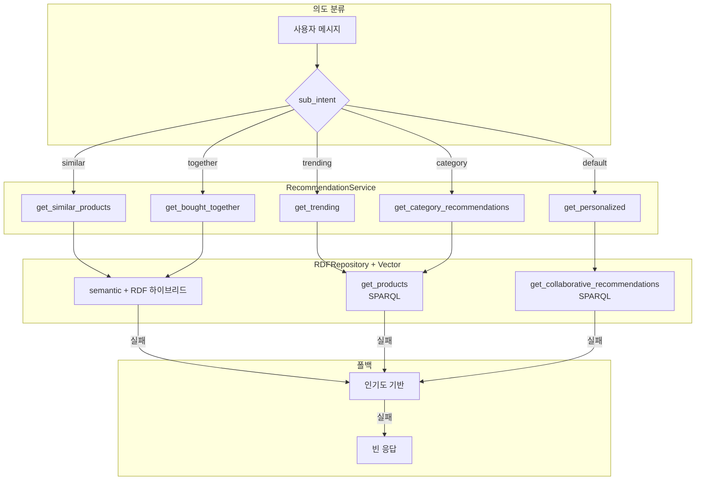
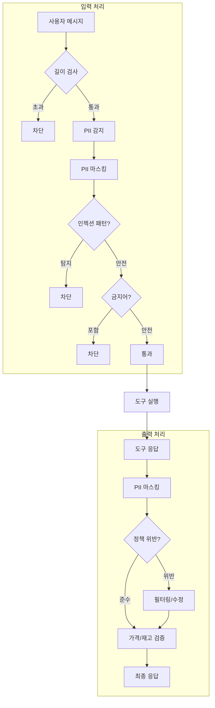

# Architecture

## 1. 개요

이 문서는 Ecommerce CS Agent 시스템의 **아키텍처**를 설명한다. 개념적 설명과 실행 관점(runtime view) 모두를 포함한다.

**최종 업데이트**: 2026-01-20
**데이터 저장소**: Apache Jena Fuseki (RDF Triple Store)
**트리플 수**: ~32,000
**버전**: v1.1.0

---

## 2. 실행 파이프라인

### 2.1 전체 흐름



### 2.2 Step별 Input/Output

| Step | Layer | Input | Output | 구현 위치 |
|------|-------|-------|--------|----------|
| 1 | Guardrails | 원본 텍스트 | 정제된 텍스트 | `src/guardrails/input_guards.py` |
| 2 | Intent | 정제된 텍스트 | `{intent, sub_intent, payload}` | `src/agents/nodes/intent_classifier.py` |
| 3 | Orchestrator | Intent 결과 | 도구 호출 결과 | `src/agents/orchestrator.py` |
| 4 | Tools | 도구 파라미터 | 비즈니스 데이터 | `src/agents/tools/*.py` |
| 5 | RDF Query | SPARQL 쿼리 | 트리플 결과 | `src/rdf/repository.py` |
| 6 | RAG Search | 검색 쿼리 | 정책 청크 | `src/rag/retriever.py` |
| 7 | LLM | 컨텍스트 + 프롬프트 | 응답 텍스트 | `src/llm/client.py` |

### 2.3 레이어별 설명

#### Guardrails Layer

- **역할**: 입력을 시스템에 안전하게 유입시키는 방화벽
- **처리 내용**: 개인정보(PII) 제거, 공격성/주입 패턴 차단, 입력 정규화
- **설계 이유**: 의미 해석을 수행하지 않으며, LLM을 사용하지 않고 오직 안정성과 보안만 책임

#### Intent Classification Layer

- **역할**: 사용자 입력을 기능 단위로 분기
- **특징**: 경량 LLM 사용, 출력은 Intent 라벨
- **안정성 보장**: Intent 분류가 잘못되더라도 이후 판단은 Ontology와 Rule에 의해 수행되므로 시스템의 진실성에는 영향이 없음

#### Orchestrator

- **역할**: Intent 결과에 따라 실행 경로 선택, 각 기능 모듈 호출
- **비역할**: 데이터 판단, 규칙 실행, 결과 생성

#### Ontology Query Layer

- **역할**: RDF Graph에서 사실 조회
- **특징**: Repository 추상화, SPARQL 기반 질의
- 조회 결과는 아직 판단이 아닌, 판단을 위한 입력 데이터

#### Rule Engine

- **시스템의 핵심 계층**: Ontology Fact를 입력으로 받아, 조건이 충족되면 새로운 관계(Derived Relation)를 생성
- **특성**: 결정론적 실행, 동일 입력에 동일 출력, 사람이 읽고 검증 가능

#### Derived Relations

Derived Relation은 사실이 아니라 판단 결과:
- PreferenceRelation
- AvoidanceRelation
- BiasRiskRelation

#### External Knowledge Merge

External Knowledge는 판단 이후 참고 정보로 병합:
- 출처(Source), 신뢰도(Confidence), 관측 시점(Time)
- 이 정보는 Rule 판단을 변경하지 않음

#### GNN Augmentation (Optional)

- **역할**: 후보 확장, 순위 보정
- **제약**: Rule 결과 덮어쓰기 금지, 단독 판단 금지

#### Explanation Layer (GraphRAG)

- 추론 과정을 그래프로 구성한 뒤, 이를 자연어로 변환
- 입력: 확정된 reasoning graph
- 출력: 설명 텍스트
- LLM은 이 단계에서만 사용

#### UI Rendering

- UI는 시스템 판단을 관찰하는 역할만 수행
- Inspection only, 데이터 수정 불가, 판단 실행 불가

---

## 3. 시스템 아키텍처

### 3.1 레이어 다이어그램

```
┌─────────────────────────────────────────────────────────────────────────┐
│                           사용자 인터페이스                               │
│  ┌─────────────┐  ┌─────────────┐  ┌─────────────┐  ┌─────────────┐     │
│  │ 고객 상담    │   │ 관리자 뷰   │   │ 통합 대시보드│  │ API 클라이언트│     │
│  │ (Gradio)    │  │ (Gradio)    │  │ (Gradio)    │  │ (REST/OpenAI)│     │
│  └──────┬──────┘  └──────┬──────┘  └──────┬──────┘  └──────┬──────┘     │
└─────────┼────────────────┼────────────────┼────────────────┼───────────┘
          │                │                │                │
          ▼                ▼                ▼                ▼
┌─────────────────────────────────────────────────────────────────────────┐
│                              API Layer                                   │
│  ┌─────────────────────────────────────────────────────────────────┐   │
│  │                     FastAPI (api.py)                             │   │
│  │  /chat  /orders  /tickets  /recommendations  /policies  /auth   │   │
│  │  /v1/chat/completions (OpenAI 호환)                              │   │
│  └─────────────────────────────────────────────────────────────────┘   │
└─────────────────────────────────────────────────────────────────────────┘
          │
          ▼
┌─────────────────────────────────────────────────────────────────────────┐
│                           Agent Layer                                    │
│  ┌───────────────┐       ┌───────────────┐    ┌───────────────┐           │
│  │Intent Classifier│───▶│ Orchestrator  │───▶│   Guardrails  │           │
│  │(키워드+LLM)     │      │ (라우팅/실행) │    │ (입출력 검증) │           │
│  └───────────────┘       └───────┬───────┘    └───────────────┘           │
│                                 │                                          │
│         ┌─────────────────────┼─────────────────────┐                   │
│         ▼                     ▼                     ▼                   │
│  ┌─────────────┐      ┌─────────────┐      ┌─────────────┐             │
│  │ Order Tools │      │ Ticket Tools│      │Recommend Tools│             │
│  │ (주문 처리) │      │ (티켓 처리) │      │ (추천 처리)  │             │
│  └─────────────┘      └─────────────┘      └─────────────┘             │
└─────────────────────────────────────────────────────────────────────────┘
          │
          ▼
┌─────────────────────────────────────────────────────────────────────────┐
│                           Data Layer                                     │
│                                                                          │
│  ┌──────────────────────────────────────────┐  ┌──────────────────┐    │
│  │         RDF Repository                    │  │  RAG Index       │    │
│  │         (src/rdf/repository.py)           │  │  (JSONL+FAISS)   │    │
│  │                                           │  │                  │    │
│  │  • Customer CRUD                          │  │ • policies.jsonl │    │
│  │  • Product CRUD                           │  │ • embeddings     │    │
│  │  • Order/OrderItem CRUD                   │  │ • vector index   │    │
│  │  • Ticket CRUD                            │  │                  │    │
│  │  • Collaborative recommendations          │  │                  │    │
│  │  • Vector search (embeddings)             │  │                  │    │
│  └────────────────────┬─────────────────────┘  └──────────────────┘    │
│                       │ SPARQL over HTTP                                │
│                       ▼                                                  │
│  ┌──────────────────────────────────────────────────────────────────┐  │
│  │                   Apache Jena Fuseki                              │  │
│  │  http://ar_fuseki:3030/ecommerce                                  │  │
│  │  ┌────────────────────────────────────────────────────────────┐  │  │
│  │  │  TDB2 Dataset: /ecommerce (~32,000 triples)                 │  │  │
│  │  │  • ontology/ecommerce.ttl (OWL ontology)                    │  │  │
│  │  │  • ontology/shacl/*.ttl (SHACL validation)                  │  │  │
│  │  │  • ontology/instances/*.ttl (customers, products, orders)   │  │  │
│  │  └────────────────────────────────────────────────────────────┘  │  │
│  └──────────────────────────────────────────────────────────────────┘  │
└─────────────────────────────────────────────────────────────────────────┘
          │
          ▼
┌─────────────────────────────────────────────────────────────────────────┐
│                         External Services                                │
│  ┌─────────────┐  ┌─────────────┐  ┌─────────────┐                     │
│  │   OpenAI    │  │  Anthropic  │  │  Local LLM  │                     │
│  │   API       │  │   API       │  │  (vLLM)     │                     │
│  └─────────────┘  └─────────────┘  └─────────────┘                     │
└─────────────────────────────────────────────────────────────────────────┘
```

### 3.2 데이터 저장소

#### Apache Jena Fuseki (Primary Data Store)

> **현재 상태**: UI + API 모두 Fuseki 단일 백엔드 사용

| 항목 | 설명 |
|------|------|
| **용도** | 모든 엔티티 데이터 (고객, 상품, 주문, 티켓) |
| **백엔드** | Apache Jena Fuseki 4.10.0 |
| **프로토콜** | SPARQL 1.1 over HTTP |
| **엔드포인트** | `http://ar_fuseki:3030/ecommerce` |
| **인증** | admin / admin123 |
| **구현** | `src/rdf/store.py`, `src/rdf/repository.py` |

**현재 데이터 통계:**
```
Products:     1,492
Orders:       491
OrderItems:   1,240
Customers:    100
Tickets:      60
Similarities: 4,416
Embeddings:   1,492 (384-dim vectors) - 전체 상품 임베딩
SHACL Shapes: 208
────────────────
Total:        ~35,000 triples
```

#### RAG Index (정책 검색)

| 항목 | 설명 |
|------|------|
| **용도** | 정책 문서 검색 |
| **파일** | `data/processed/policies_index.jsonl`, `policies_vectors.faiss` |
| **모드** | keyword / embedding / **hybrid (기본값)** |
| **문서 수** | 63개 정책 문서 |
| **구현** | `src/rag/retriever.py` |

**검색 모드:**
```
keyword   - TF 기반 키워드 매칭
embedding - FAISS 벡터 유사도 (multilingual-e5-small)
hybrid    - 키워드 30% + 임베딩 70% (configurable) ← 현재 활성화
```

### 3.3 온톨로지 구조

**파일 위치**: `ontology/`

| 파일 | 설명 | 트리플 수 |
|------|------|----------|
| `ecommerce.ttl` | OWL 온톨로지 스키마 | 174 |
| `shacl/ecommerce-shapes.ttl` | SHACL 검증 규칙 | 208 |
| `instances/customers.ttl` | 고객 인스턴스 | 100 |
| `instances/products.ttl` | 상품 인스턴스 | 1,492 |
| `instances/orders.ttl` | 주문/주문항목 인스턴스 | 1,731 |
| `instances/tickets.ttl` | 티켓 인스턴스 | 60 |
| `instances/similarities.ttl` | 상품 유사도 관계 | 4,416 |
| `instances/embeddings.ttl` | 벡터 임베딩 (전체 상품) | 1,492 |

#### 3.3.1 ER 다이어그램



#### 3.3.2 엔티티별 상세 속성

##### Customer (고객)

| 속성 | 타입 | 필수 | 제약조건 |
|------|------|------|---------|
| customerId | string | ✓ | PK, `user_XXX` 패턴 |
| name | string | ✓ | 1자 이상 |
| email | string | ✓ | UK, 이메일 형식 |
| phone | string | | |
| address | string | | |
| membershipLevel | string | | `bronze`, `silver`, `gold`, `platinum` |

##### Product (상품)

| 속성 | 타입 | 필수 | 제약조건 |
|------|------|------|---------|
| productId | string | ✓ | PK |
| title | string | ✓ | 1자 이상 |
| brand | string | ✓ | |
| price | decimal | ✓ | ≥ 0 |
| averageRating | decimal | | 0 ~ 5 |
| ratingNumber | integer | | |
| stockStatus | string | | `in_stock`, `out_of_stock`, `limited` |

##### Order (주문)

| 속성 | 타입 | 필수 | 제약조건 |
|------|------|------|---------|
| orderId | string | ✓ | PK, `ORD_YYYYMMDD_XXXX` 패턴 |
| status | string | ✓ | `pending`, `confirmed`, `shipping`, `delivered`, `cancelled` |
| orderDate | dateTime | ✓ | |
| deliveryDate | dateTime | | |
| totalAmount | decimal | ✓ | ≥ 0 |
| shippingAddress | string | ✓ | 1자 이상 |

##### OrderItem (주문 항목)

| 속성 | 타입 | 필수 | 제약조건 |
|------|------|------|---------|
| quantity | integer | ✓ | ≥ 1 |
| unitPrice | decimal | ✓ | ≥ 0 |
| hasProduct | Product | ✓ | FK, 정확히 1개 |
| belongsToOrder | Order | ✓ | FK, 정확히 1개 |

##### Ticket (지원 티켓)

| 속성 | 타입 | 필수 | 제약조건 |
|------|------|------|---------|
| ticketId | string | ✓ | PK, `TICKET_[0-9]+` 패턴 |
| issueType | string | ✓ | `shipping`, `refund`, `exchange`, `product_inquiry`, `order_inquiry`, `complaint`, `other` |
| description | string | | |
| priority | string | ✓ | `low`, `normal`, `high`, `urgent` |
| status | string | ✓ | `open`, `in_progress`, `resolved`, `closed` |
| createdAt | dateTime | ✓ | |
| resolvedAt | dateTime | | |

##### Company (기업)

| 속성 | 타입 | 필수 | 제약조건 |
|------|------|------|---------|
| companyId | string | ✓ | PK, `COM_XXX` 패턴 |
| companyName | string | ✓ | 1~200자 |
| industry | string | ✓ | `Electronics`, `Technology`, `Retail`, `Manufacturing`, `Healthcare`, `Finance`, `Automotive`, `Consumer Goods`, `Telecommunications`, `Other` |
| companySize | string | ✓ | `startup`, `small`, `medium`, `large`, `enterprise` |
| foundedYear | integer | | 1800 ~ 2026 |
| headquarters | string | | 1자 이상 |
| employeeCount | integer | | ≥ 1 |
| annualRevenue | decimal | | ≥ 0 (억원 단위) |
| website | anyURI | | `https?://.*` 패턴 |
| stockTicker | string | | 1~10자 대문자 영숫자 |

##### BusinessRelationship (비즈니스 관계)

| 속성 | 타입 | 필수 | 제약조건 |
|------|------|------|---------|
| hasSourceCompany | Company | ✓ | FK, 정확히 1개 |
| hasTargetCompany | Company | ✓ | FK, 정확히 1개 |
| relationshipType | string | ✓ | `supplier`, `partner`, `competitor`, `subsidiary` |
| relationshipStartDate | date | ✓ | |
| relationshipEndDate | date | | null이면 진행 중 |
| relationshipStrength | decimal | | 0.0 ~ 1.0 |

#### 3.3.3 관계(Object Properties) 완전 목록

| 관계 | 소스 → 타겟 | 역관계 | 특성 |
|------|-------------|--------|------|
| purchased | Customer → Product | purchasedBy | |
| placedOrder | Customer → Order | orderedBy | |
| containsItem | Order → OrderItem | belongsToOrder | |
| hasProduct | OrderItem → Product | isProductOf | Functional |
| similarTo | Product ↔ Product | (self) | Symmetric |
| inCategory | Product → Category | hasProduct_category | |
| hasTicket | Customer → Ticket | ticketOf | |
| relatedToOrder | Ticket → Order | hasRelatedTicket | |
| appliesTo | Policy → Category | | |
| manufactures | Company → Product | manufacturedBy | |
| distributes | Company → Product | distributedBy | |
| worksAt | Customer → Company | hasEmployee | |
| purchasedFrom | Customer → Company | soldTo | |
| subscribedTo | Customer → Company | hasSubscriber | |
| supplierOf | Company → Company | hasSupplier | |
| partnerWith | Company ↔ Company | (self) | Symmetric |
| competitorOf | Company ↔ Company | (self) | Symmetric |
| subsidiaryOf | Company → Company | hasSubsidiary | Transitive |
| hasSourceCompany | BusinessRelationship → Company | | Functional |
| hasTargetCompany | BusinessRelationship → Company | | Functional |

#### 3.3.4 카디널리티 제약

| 제약 | 설명 |
|------|------|
| Order 1+ OrderItem | 주문은 최소 1개 항목 필요 |
| OrderItem = 1 Product | 항목당 정확히 1개 상품 |
| OrderItem = 1 Order | 항목은 정확히 1개 주문에 소속 |
| Order = 1 Customer | 주문은 정확히 1명 고객 |
| Ticket = 1 Customer | 티켓은 정확히 1명 고객 |
| Product ≤ 1 Company (manufacturedBy) | 상품 제조사는 최대 1개 |
| Customer ≤ 1 Company (worksAt) | 고객 근무처는 최대 1개 |
| Company ≤ 1 Company (subsidiaryOf) | 자회사는 최대 1개 모회사 |
| BusinessRelationship = 1 Company (source) | 관계는 정확히 1개 시작 기업 |
| BusinessRelationship = 1 Company (target) | 관계는 정확히 1개 대상 기업 |

#### 3.3.5 RAG Policy Index (FAISS)

**파일 위치**: `data/processed/`

| 파일 | 설명 |
|------|------|
| `policies_vectors.faiss` | FAISS 벡터 인덱스 |
| `policies_index.jsonl` | 텍스트 인덱스 + 메타데이터 |
| `policies_embeddings.npy` | 임베딩 캐시 (numpy) |

**Policy Index 스키마** (`policies_index.jsonl`):

| 필드 | 타입 | 설명 |
|------|------|------|
| id | string | 정책 문서 ID (해시) |
| text | string | 정책 본문 |
| metadata.url | string | 원본 URL |
| metadata.title | string | 정책 제목 |
| metadata.doc_type | string | `refund`, `shipping`, `exchange`, `cancel`, `support`, `membership`, `payment`, `points`, `coupon`, `privacy`, `claim`, `promotion`, `gift`, `review`, `warranty`, `installation` |
| metadata.source | string | 데이터 출처 |

**임베딩 설정**:
- 모델: `intfloat/multilingual-e5-small`
- 차원: 384
- 정규화: L2 normalized
- 검색 모드: hybrid (키워드 30% + 임베딩 70%)

#### 3.3.6 RDF 벡터 임베딩

**파일 위치**: `ontology/instances/embeddings.ttl`

RDF에 저장된 고객/상품 벡터 임베딩:

| 속성 | 설명 |
|------|------|
| `ecom:embedding` | Base64 인코딩된 float32 벡터 (384차원) |

**사용처**:
- Customer/Product 벡터 유사도 검색
- SPARQL 쿼리를 통한 벡터 검색 (`src/rdf/repository.py:vector_search()`)

**관련 구현**:
- `src/rag/retriever.py` - PolicyRetriever (FAISS 검색)
- `src/rag/embedder.py` - Embedder (sentence-transformers)
- `src/rdf/repository.py` - RDF 벡터 검색

---

## 4. 핵심 컴포넌트

### 4.1 Agent Layer

#### 4.1.1 Intent Classification (의도 분류) - 상세

의도 분류는 **이중 분류 시스템(Dual Classification System)** 으로 구현되어 있다:

1. **키워드 기반 분류** (Primary, Fast)
2. **LLM 기반 분류** (Secondary, Accurate)

##### 분류 전략: LLM-First with Keyword Fallback



##### IntentResult 데이터 구조

```python
@dataclass
class IntentResult:
    intent: str           # 주 의도: order, claim, policy, recommend, general
    sub_intent: str       # 세부 의도: list, detail, status, cancel, similar, ...
    payload: Dict         # 추출된 엔티티: order_id, query, issue_type, ...
    confidence: str       # 신뢰도: low, medium, high
    source: str           # 분류 출처: "keyword" 또는 "llm"
    reason: str           # 분류 근거 (디버그용)
```

##### 키워드 분류 로직 상세 (classify_intent_keyword)

키워드 분류는 **우선순위 기반 패턴 매칭**으로 동작:

| 우선순위 | 조건 | 결과 |
|---------|------|------|
| 1 | 주문 ID 패턴 + 취소 키워드 | `order/cancel` |
| 2 | 주문 ID 패턴 + 상태 키워드 | `order/status` |
| 3 | 주문 ID 패턴 + 상세 키워드 | `order/detail` |
| 4 | 주문 ID 패턴만 | `order/detail` (기본) |
| 5 | 정책 키워드 or 질문 패턴 | `policy` |
| 6 | 주문 키워드 (ID 없음) | `order/list` |
| 7 | 클레임 키워드 | `claim` + issue_type |
| 8 | 추천 키워드 | `recommend` + sub_intent |
| 9 | 일반 대화 키워드 | `general` |
| 10 | 매칭 실패 | `unknown` (폴백) |

**키워드 설정** (`configs/intents.yaml`):

```yaml
intents:
  order:
    keywords: ["주문", "배송", "취소", "결제", "구매"]
    sub_intents:
      cancel:
        keywords: ["취소"]
      status:
        keywords: ["상태", "배송", "어디"]
      detail:
        keywords: ["상세", "내역", "정보"]
  
  claim:
    keywords: ["환불", "교환", "불량", "클레임", "고장"]
    issue_types:
      refund: { keywords: ["환불"] }
      exchange: { keywords: ["교환"] }
      defect: { keywords: ["불량", "고장", "파손"] }
  
  recommend:
    keywords: ["추천", "비슷한", "유사한", "인기", "트렌드"]
    sub_intents:
      similar: { keywords: ["비슷한", "유사한"] }
      trending: { keywords: ["인기", "트렌드", "베스트"] }
      together: { keywords: ["함께", "같이 사는"] }
```

##### LLM 분류 로직 상세 (classify_intent_llm)

LLM 분류는 다음 조건에서 사용:

1. `llm_classification.enabled: true` 설정
2. LLM API 키가 유효
3. 키워드 분류 전에 먼저 시도 (설정에 따라)

**LLM 프롬프트 구조** (`prompts/intent_classification.txt`):

```
사용자 메시지를 분석하여 의도를 JSON으로 반환하세요.

의도 종류:
- order: 주문 조회, 상태, 취소 (sub_intent: list, detail, status, cancel)
- claim: 환불/교환 요청 (entities: order_id, issue_type)
- policy: 정책/FAQ 질문
- recommend: 상품 추천 (sub_intent: similar, personal, trending, together)
- general: 일반 대화

응답 형식:
{
  "intent": "order",
  "sub_intent": "status",
  "confidence": "high",
  "entities": { "order_id": "ORD-20251201-001" },
  "reason": "주문 ID와 배송 상태 질문 패턴"
}
```

**신뢰도 임계값**:

```yaml
llm_classification:
  enabled: true
  confidence_threshold: "medium"  # low < medium < high
  fallback_to_keyword: true       # LLM 실패/저신뢰 시 키워드 폴백
```

##### 의도별 payload 구성

| 의도 | sub_intent | payload 필드 |
|------|------------|-------------|
| order | list | `limit: int` |
| order | detail | `order_id: str` |
| order | status | `order_id: str` |
| order | cancel | `order_id: str, reason: str` |
| claim | - | `action: str, order_id: str, issue_type: str, description: str` |
| policy | - | `query: str, top_k: int` |
| recommend | similar | `product_id: str, query: str` |
| recommend | personal | `query: str` |
| recommend | trending | `category_id: str, query: str` |
| general | - | `message: str` |

##### 주문 ID 추출

```python
# configs/intents.yaml
patterns:
  order_id: "\\bORD[-_][A-Za-z0-9_-]+\\b"  # ORD-xxx 또는 ORD_xxx

# 예시
"ORD-20251201-001 취소해주세요" → order_id = "ORD-20251201-001"
```

#### 4.1.2 Orchestrator (오케스트레이터)

오케스트레이터는 **의도 분류 결과를 받아 도구 실행 → 응답 생성**을 수행:



##### AgentState 데이터 구조

```python
@dataclass
class AgentState:
    user_id: str              # 현재 사용자 ID
    intent: str               # 분류된 의도
    sub_intent: Optional[str] # 세부 의도
    payload: Dict[str, Any]   # 추출된 파라미터
    final_response: Optional[Dict] = None  # 최종 응답
```

##### 도구 실행 흐름

| 의도 | 도구 함수 | 데이터 소스 |
|------|----------|------------|
| order/list | `handle_order_query(user_id, "list", payload)` | RDF Repository |
| order/detail | `handle_order_query(user_id, "detail", payload)` | RDF Repository |
| order/cancel | `handle_order_query(user_id, "cancel", payload)` | RDF Repository |
| claim | `handle_claim(user_id, payload)` | RDF Repository |
| policy | `PolicyRetriever.search_policy(query, top_k)` | RAG Index |
| recommend | `handle_recommendation(user_id, sub_intent, payload)` | RDF + Vector |

##### 응답 생성 전략

1. **LLM 사용 가능**: `generate_response()` 또는 `generate_routed_response()` 호출
2. **LLM 사용 불가/실패**: `_format_template_response()` 템플릿 사용

```python
# LLM 사용 가능 여부 판단
def _is_llm_available() -> bool:
    config = get_llm_config()
    if config.provider in ("openai", "anthropic"):
        return bool(config.api_key)
    elif config.provider == "local":
        return bool(config.base_url)
    return False
```

##### 실행 추적 (Tracing)

모든 주요 단계에서 `add_trace()` 호출:

```python
add_trace(
    "tool",                            # 추적 유형
    f"주문 도구: {sub_intent}",        # 설명
    input_data={...},                  # 입력
    output_data={...},                 # 출력
    duration_ms=tool_duration,         # 소요 시간
    success=True                       # 성공 여부
)
```

**추적 유형**:
- `orchestrator`: 오케스트레이터 시작/종료
- `guard`: 가드레일 실행
- `tool`: 도구 호출
- `llm`: LLM 응답 생성

### 4.2 RDF Repository

**RDFRepository 주요 기능:**
```python
# src/rdf/repository.py

# 고객
get_customer(customer_id)
get_customers(limit, offset)
count_customers()

# 상품
get_product(product_id)
get_products(limit, offset)
count_products()

# 주문
get_order(order_id)
get_user_orders(user_id, status, limit)
get_order_items(order_id)
get_order_detail(order_id)
get_order_status(order_id)
update_order_status(order_id, status)
count_orders()

# 티켓
get_ticket(ticket_id)
get_user_tickets(user_id, status, limit)
create_ticket(user_id, issue_type, description, priority, order_id)
update_ticket_status(ticket_id, status)
count_tickets()

# 추천
get_collaborative_recommendations(user_id, limit)
get_similar_products(product_id, limit)
vector_search(query_embedding, limit)
```

### 4.3 RAG Index

**파이프라인 단계:**

1. **수집/정규화**: `scripts/01a_crawl_policies.py`
   - 입력: 환경변수 `POLICY_LOCAL_HTML`에 로컬 HTML 경로 지정 가능
   - 출력: `data/processed/policies.jsonl`

2. **인덱싱**: `scripts/04_build_index.py`
   - 입력: `data/processed/policies.jsonl`
   - 출력: `policies_index.jsonl`, `policies_vectors.faiss`, `policies_embeddings.npy`

3. **검색**: `src/rag/retriever.py`
   - **하이브리드 모드**: 키워드 TF 30% + FAISS 벡터 유사도 70%

### 4.4 추천 시스템

모든 추천 알고리즘은 RDF Repository를 통해 SPARQL 쿼리와 벡터 검색을 조합하여 구현:

| 알고리즘 | 설명 | 구현 |
|---------|------|------|
| **Collaborative** | 유사 사용자 구매 패턴 | `get_collaborative_recommendations()` |
| **Content-Based** | 상품 유사도 관계 | `get_similar_products()` |
| **Vector Search** | 임베딩 기반 유사도 | `search_products_by_embedding()` |

#### 4.4.1 추천 유형별 데이터 소스

| 추천 유형 | 예시 질문 | 데이터 소스 |
|----------|----------|------------|
| 속성 필터링 | "빨간색 운동화 5만원 이하" | RDF ✅ |
| 관계 탐색 | "이 상품 구매자가 함께 산 것" | RDF ✅ |
| 시맨틱 유사 | "이 신발이랑 비슷한 느낌" | Vector ✅ |
| 설명 기반 | "가벼운 러닝화 추천해줘" | Vector ✅ |

#### 4.4.2 추천 알고리즘 조합

| 추천 유형 | 주 알고리즘 | 데이터 소스 | 점수 계산 |
|----------|-----------|------------|----------|
| **Personalized** | 협업 필터링 (CF) | SPARQL (ecom:purchased) | 공통구매 고객 수 / 10 |
| **Similar** | 하이브리드 (벡터+RDF) | Vector Index + ecom:similarTo | 코사인 유사도 |
| **Trending** | 인기도 기반 | SPARQL (평점, 리뷰수) | rating × (1 + 0.1 × reviews) |
| **Bought Together** | 협회 규칙 | SPARQL | (현재 Similar와 동일) |
| **Category** | 인기도 + 필터링 | SPARQL + min_rating 필터 | rating / 5 |

#### 4.4.3 하이브리드 파이프라인

```
get_similar_products(method="hybrid")

1. Semantic 검색 시도
   ├─ 기준 상품 조회 (RDF)
   ├─ 쿼리 임베딩 생성 (Embedder)
   ├─ 벡터 유사도 검색 (search_products_by_embedding)
   └─ 자기 자신 제외 후 상위 K개 반환
         ↓ (결과 없음)
2. RDF 폴백
   └─ similarTo 관계 조회 (SPARQL)
         ↓ (결과 없음)
3. 빈 응답 (is_fallback=True)
```

**메서드 파라미터:**
- `method="semantic"`: 벡터 유사도만 사용
- `method="rdf"`: RDF similarTo 관계만 사용
- `method="hybrid"` (기본값): semantic 먼저, 실패 시 RDF 폴백

#### 4.4.4 추천 흐름도



#### 4.4.5 점수 계산 공식

```
# 협업 필터링 점수
score = min(1.0, common_purchase_count / 10)

# 인기도 점수
popularity = rating × (1 + 0.1 × min(reviews, 100))
score = min(1.0, popularity / 10)

# 벡터 유사도
similarity = dot(v1, v2) / (||v1|| × ||v2||)  # 코사인 유사도
```

#### 4.4.6 폴백 메커니즘

```
1차: RDF 기반 쿼리
    ↓ (결과 없음)
2차: 인기도 기반 (평점 × 리뷰수)
    ↓ (실패)
3차: 빈 응답 (is_fallback=True)
```

#### 4.4.7 SPARQL 협업 필터링 예시

```sparql
SELECT ?productId ?title (COUNT(?other) as ?score)
WHERE {
    # 나와 같은 상품을 구매한 다른 고객
    ?me ecom:customerId "user_001" ; ecom:purchased ?common .
    ?other ecom:purchased ?common ; ecom:purchased ?product .

    # 필터: 다른 고객이고, 내가 아직 구매하지 않은 상품
    FILTER(?other != ?me)
    FILTER NOT EXISTS { ?me ecom:purchased ?product }

    ?product ecom:productId ?productId ; ecom:title ?title .
}
GROUP BY ?productId ?title
ORDER BY DESC(?score)
LIMIT 10
```

> 📖 **상세 기술 문서**: [docs/graph_recommendation_system.md](graph_recommendation_system.md)
> - Neo4j vs RDFLib 비교
> - SPARQL 쿼리 전체
> - A/B 테스팅 프레임워크

### 4.5 LLM 통합

**LLM 라우팅:**
```yaml
# configs/llm.yaml
routing:
  rules:
    - when: { intents: ["policy", "claim", "order"] }
      provider: local  # 파인튜닝된 로컬 모델
    - when: { intents: ["general", "product_info"] }
      provider: openai  # 범용 모델
  fallback:
    provider: openai
```

**지원 LLM:**

| Provider | 용도 | 설정 |
|----------|------|------|
| OpenAI | 범용 응답, 분류 | `OPENAI_API_KEY` |
| Anthropic | 대안 | `ANTHROPIC_API_KEY` |
| Local (vLLM) | 파인튜닝 모델 | `local.base_url` |

---

## 5. API 구조

### REST 엔드포인트

```
# 인증
POST /auth/register, /auth/login, /auth/refresh
GET  /auth/me
POST /auth/logout

# 주문 (RDF Repository 사용)
GET  /users/{user_id}/orders
GET  /orders/{order_id}
POST /orders/{order_id}/cancel

# 티켓 (RDF Repository 사용)
POST /tickets
GET  /tickets/{ticket_id}
POST /tickets/{ticket_id}/resolve

# 추천 (RDF Repository 사용)
GET  /recommendations/similar/{product_id}
GET  /recommendations/personalized/{user_id}
GET  /recommendations/trending
GET  /recommendations/bought-together/{product_id}

# 정책 (RAG Index 사용)
GET  /policies/search?q=...

# 채팅
POST /chat
```

### OpenAI 호환 API

```
GET  /v1/models
POST /v1/chat/completions

# LibreChat, OpenWebUI 등과 호환
```

### 모니터링

```
GET /health      - 헬스 체크 (Fuseki 연결, triple count)
GET /ready       - 준비 상태 (triple count > 0)
GET /metrics     - Prometheus 메트릭
```

---

## 6. UI 구조

### Gradio 탭 구성 (ui.py) - 8개 탭

| 탭 | 용도 | 데이터 소스 | 시각화 |
|----|------|------------|-------|
| 고객 상담 | 채팅, 주문 조회, 추천 | Agent Layer | - |
| 고객 관리 | 고객 목록, 상세, 관계도 | RDF Repository | Plotly |
| 주문 관리 | 전체 주문, 필터링 | RDF Repository | - |
| 상품 관리 | 상품 목록 | RDF Repository | - |
| 그래프 시각화 | 노드/엣지 통계 | RDF Repository | **Plotly** |
| 정책 관리 | 정책 CRUD | RAG Index | - |
| 통합 대시보드 | 고객 360° 뷰 | RDF Repository | Plotly |
| **데이터 관리** | CSV 내보내기/가져오기 | All | - |

### 통합 대시보드

```
고객 ID 입력
    │
    ├──▶ RDF Repository: 주문 내역, 티켓 내역
    │
    ├──▶ RDF Repository: 구매 상품, 관계도 시각화 (Plotly)
    │
    └──▶ RDF Repository: 개인화 추천
```

---

## 7. 보안 및 가드레일

가드레일은 **입력 안정화**와 **출력 검증**을 담당하는 비-LLM 계층이다. LLM을 사용하지 않으며, 패턴 매칭과 규칙 기반으로 동작한다.

### 7.1 가드레일 파이프라인 개요



### 7.2 입력 가드레일 상세

**파일**: `src/guardrails/input_guards.py`

#### InputGuardResult 구조

```python
@dataclass
class InputGuardResult:
    blocked: bool              # 차단 여부
    block_reason: Optional[str]  # 차단 사유
    sanitized_text: str        # 정제된 텍스트
    pii_detected: List[Dict]   # 감지된 PII 목록
    warnings: List[str]        # 경고 메시지
```

#### PII 패턴 (한국어 특화)

| 패턴 키 | 설명 | 정규식 예시 | 마스킹 |
|--------|------|------------|--------|
| `phone_kr` | 휴대폰 번호 | `010-\d{4}-\d{4}` | `***-****-****` |
| `email` | 이메일 주소 | `[\w.-]+@[\w.-]+` | `***@***.***` |
| `rrn` | 주민등록번호 | `\d{6}-[1-4]\d{6}` | `******-*******` |
| `card` | 카드 번호 | `\d{4}-\d{4}-\d{4}-\d{4}` | `****-****-****-****` |
| `account` | 계좌 번호 | `\d{3,4}-\d{2,6}-\d{2,6}` | `***-***-***` |

**설정** (`configs/guardrails.yaml`):

```yaml
pii_patterns:
  phone_kr:
    pattern: "01[016789]-?\\d{3,4}-?\\d{4}"
    mask: "***-****-****"
  email:
    pattern: "[a-zA-Z0-9._%+-]+@[a-zA-Z0-9.-]+\\.[a-zA-Z]{2,}"
    mask: "***@***.***"
  rrn:
    pattern: "\\d{6}-[1-4]\\d{6}"
    mask: "******-*******"
```

#### 프롬프트 인젝션 방어

탐지 패턴:

```yaml
injection_patterns:
  - "ignore previous"
  - "ignore above"
  - "disregard all"
  - "system prompt"
  - "you are now"
  - "새로운 지시"
  - "이전 지시 무시"
  - "관리자 모드"
```

#### 금지어 필터링

```yaml
blocked_words:
  - "비밀번호"
  - "password"
  - "api_key"
  - "secret"
```

### 7.3 출력 가드레일 상세

**파일**: `src/guardrails/output_guards.py`

#### OutputGuardResult 구조

```python
@dataclass
class OutputGuardResult:
    sanitized_text: str        # 정제된 응답
    pii_masked: List[Dict]     # 마스킹된 PII
    policy_violations: List[Dict]  # 정책 위반 목록
    warnings: List[str]        # 경고
```

#### 정책 위반 검사

```python
POLICY_VIOLATIONS = [
    # 잘못된 환불 기간 약속
    (r"(\d+)일\s*이내.*환불", 
     lambda m: int(m.group(1)) > 30, 
     "환불 기간 30일 초과 불가"),
    
    # 무조건 100% 환불 약속
    (r"100%\s*환불", 
     lambda m: True, 
     "무조건 100% 환불 약속은 정책 위반"),
    
    # 즉시 처리 약속
    (r"즉시\s*(환불|입금|처리)", 
     lambda m: True, 
     "즉시 처리 약속은 정책 위반"),
]
```

### 7.4 가격/재고 검증

응답에 포함된 상품 정보가 실제 데이터와 일치하는지 검증:

```python
def validate_price_stock(resp: Dict) -> Dict:
    """
    응답의 가격/재고가 CSV/RDF 데이터와 일치하는지 확인
    
    Returns:
        {"ok": bool, "mismatches": [...]}
    """
```

### 7.5 통합 가드레일 함수

**파일**: `src/guardrails/pipeline.py`

```python
def process_input(text: str, strict_mode: bool = False) -> InputGuardResult:
    """입력 가드레일 통합 실행"""

def apply_guards(response: Dict) -> Dict:
    """출력 가드레일 통합 실행 - 모든 응답 필수 래핑"""
```

**사용 예시** (orchestrator):

```python
# 입력 가드레일
input_guard_result = process_input(user_message, strict_mode=True)
if input_guard_result.blocked:
    return {"error": input_guard_result.block_reason, "blocked": True}

# ... 도구 실행 ...

# 출력 가드레일 (필수)
state.final_response = apply_guards({
    "response": llm_response,
    "data": tool_result,
})
```

### 7.6 가드레일 추적

가드레일 실행 결과는 트레이싱 시스템에 기록:

```python
add_trace(
    "guard", "입력 가드레일",
    input_data={"message_length": len(user_message)},
    output_data={
        "blocked": input_guard_result.blocked,
        "pii_count": len(input_guard_result.pii_detected),
        "warnings": input_guard_result.warnings[:3]
    },
    duration_ms=guard_duration,
    success=not input_guard_result.blocked
)
```

---

## 8. 아키텍처 원칙

### 불변 규칙

- **판단은 Rule Engine에서만 발생**: 모든 비즈니스 로직 판단은 결정론적 Rule Engine에서 수행
- **LLM은 설명자**: LLM은 Explanation Layer에서만 사용되며, 판단을 내리지 않음
- **UI는 관찰자**: UI는 시스템 판단을 관찰만 하며, 데이터 수정이나 판단 실행 불가

### Truth Order

시스템의 진실성(Truth)은 다음 순서로 결정:

1. **Ontology Fact** - RDF Graph에서 조회된 사실
2. **Rule Engine** - 조건 기반 판단
3. **Derived Relations** - 판단 결과로 생성된 관계
4. **External Knowledge** - 참고 정보 (판단 변경 불가)

---

## 부록

### A. 설정 파일

#### configs/rdf.yaml

```yaml
rdf:
  backend: "fuseki"  # fuseki | rdflib
fuseki:
  endpoint: "http://ar_fuseki:3030/ecommerce"
  user: "admin"
  password: "admin123"
```

#### configs/llm.yaml

```yaml
default_provider: "openai"
openai:
  model: "gpt-4o-mini"
  temperature: 0.7
  max_tokens: 1024
```

#### configs/rag.yaml

```yaml
mode: "hybrid"  # keyword | embedding | hybrid
hybrid:
  keyword_weight: 0.3
  embedding_weight: 0.7
embedding:
  model: "intfloat/multilingual-e5-small"
```

### B. 기술 스택

#### 사용 중 (✅)

| 기술 | 버전 | 용도 | 위치 |
|------|------|------|------|
| **Python** | 3.10+ | 런타임 | - |
| **FastAPI** | 0.128+ | API 서버 | `api.py` |
| **Gradio** | 6.3+ | UI | `ui.py` |
| **Apache Jena Fuseki** | 4.10.0 | Triple Store | Docker |
| **RDFLib** | 7.5+ | SPARQL 클라이언트 | `src/rdf/store.py` |
| **FAISS** | 1.13+ | 벡터 검색 (RAG) | `src/rag/retriever.py` |
| **sentence-transformers** | 5.2+ | 임베딩 생성 | `src/rag/`, `scripts/15_*.py` |
| **NumPy** | 2.2+ | 벡터 연산 | `src/rdf/store.py` |
| **Pandas** | 2.3+ | 데이터 처리 | `scripts/` |
| **PyYAML** | 6.0+ | 설정 파일 | `configs/` |
| **Pydantic** | 2.12+ | 데이터 검증 | `src/*/models.py` |
| **python-jose** | 3.3+ | JWT 인증 | `src/auth/jwt_handler.py` |
| **passlib** | 1.7+ | 비밀번호 해싱 | `src/auth/password.py` |
| **prometheus-client** | 0.23+ | 메트릭 수집 | `src/monitoring/` |
| **OpenAI SDK** | 2.14+ | LLM API 호출 | `src/llm/client.py` |
| **Anthropic SDK** | 0.71+ | LLM API 호출 (대안) | `src/llm/client.py` |
| **pytest** | 9.0+ | 테스트 | `tests/` |

#### 레거시 (❌ 미사용)

| 기술 | 설명 | 상태 |
|------|------|------|
| SQLite | 이전 트랜잭션 데이터 | Fuseki로 대체됨 |
| NetworkX | 이전 그래프 연산 | RDF로 대체됨 |
| CSV Repository | 이전 Mock 데이터 | TTL로 대체됨 |

#### 확장 시 고려

| 기술 | 용도 | 도입 시기 |
|------|------|----------|
| **Neo4j** | 대규모 그래프 DB | GDS 알고리즘 필요 시 |
| **vLLM/Ollama** | 로컬 LLM 서빙 | 비용 절감, 프라이버시 필요 시 |
| **Redis** | 캐싱, 세션 관리 | 다중 인스턴스 배포 시 |
| **Kafka** | 이벤트 스트리밍 | 실시간 처리 필요 시 |

### C. 파일 구조 요약

```
ecommerce-cs-agent/
├── api.py                 # FastAPI 서버
├── ui.py                  # Gradio UI (8탭, Plotly 시각화)
├── ontology/              # RDF 온톨로지 및 인스턴스 데이터
│   ├── ecommerce.ttl      # OWL 온톨로지 스키마
│   ├── shacl/             # SHACL 검증 규칙
│   └── instances/         # 인스턴스 데이터 (TTL)
├── src/
│   ├── rdf/               # RDF 저장소 (Primary)
│   │   ├── store.py       # FusekiStore (SPARQL HTTP 클라이언트)
│   │   └── repository.py  # RDFRepository (모든 CRUD)
│   ├── agents/            # 오케스트레이터, 의도 분류, 도구
│   ├── auth/              # JWT 인증
│   ├── conversation/      # 대화 세션 관리
│   ├── guardrails/        # 입출력 검증
│   ├── llm/               # LLM 클라이언트
│   ├── rag/               # 정책 검색
│   ├── recommendation/    # 추천 서비스 (RDF 사용)
│   └── vision/            # 이미지 분석 (선택)
├── configs/               # YAML 설정
├── data/
│   └── processed/         # RAG 인덱스
├── scripts/               # 데이터 파이프라인
├── tests/                 # pytest
└── docs/                  # 문서
```
