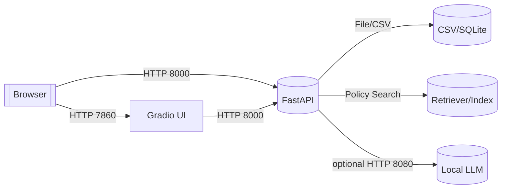
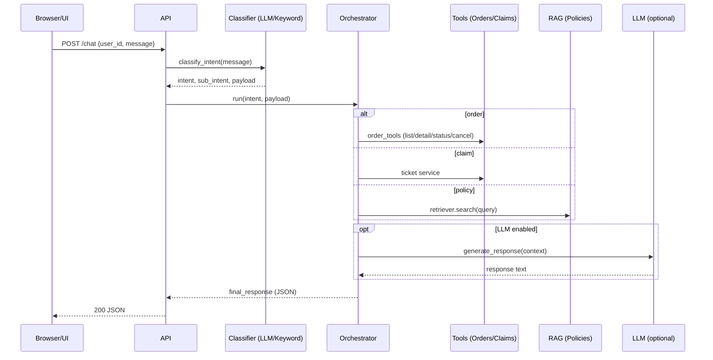
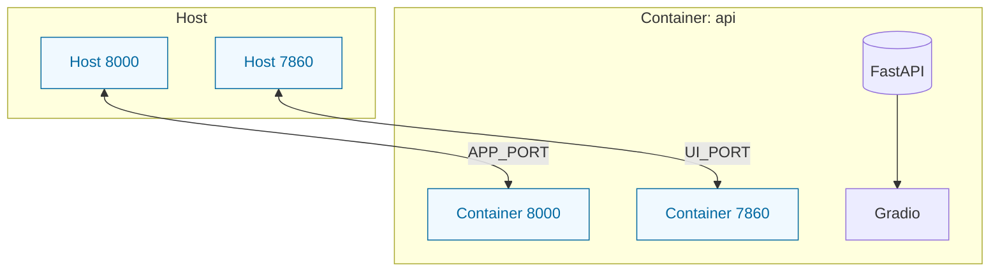

Ports and Flows
===============

This document explains how the API/UI/LLM pieces bind to ports, how requests flow through the system, and how to start/stop each component cleanly. Defaults reflect the current config (configs/app.yaml).

Port Summary
------------
- API (FastAPI): 8000 (server.port)
- UI (Gradio): 7860 (server.ui_port)
- Local LLM (vLLM): 8080 (optional)

Environment Overrides
---------------------
- API: APP_HOST / APP_PORT (fallback to configs/app.yaml → API_* env → default 0.0.0.0:8000)
- UI: UI_HOST / UI_PORT (fallback to configs/app.yaml → default 0.0.0.0:7860)

Start/Access/Stop
-----------------
- Start (local):
  - API: python scripts/serve_api.py
  - UI: python ui.py
  - Health: curl http://localhost:8000/healthz
  - UI: http://localhost:7860
- Start (Docker Compose):
  - docker-compose up -d
  - APP_PORT=9000 UI_PORT=7000 docker-compose up -d
- Stop:
  - pkill -f "uvicorn api:app" || true
  - pkill -f "python ui.py" || true

Port Forwarding Tips
--------------------
- SSH: ssh -L 8000:localhost:8000 -L 7860:localhost:7860 -L 8080:localhost:8080 <user>@<host>
- Docker: -p 8000:8000 -p 7860:7860 -p 8080:8080
- Codespaces/remote IDE: Publish/Forward 8000/7860/8080

Request Flow (Local)
--------------------

Chat Pipeline (High-level)
--------------------------

Compose Topology
----------------

Operational Notes
-----------------
- Health endpoints: /healthz, /health, /ready, /metrics
- Smoke: bash scripts/smoke_api.sh (BASE_URL defaults to http://localhost:8000)
- OpenAI-compatible layer (optional): /v1/models, /v1/chat/completions

Troubleshooting
---------------
- Port in use: kill existing service or choose alternate APP_PORT/UI_PORT
- UI not showing: check logs/ui.log; ensure UI_PORT matches docs and forwarding is set
- LLM path issues: confirm provider keys or vLLM at 8080 (curl http://localhost:8080/v1/models)

