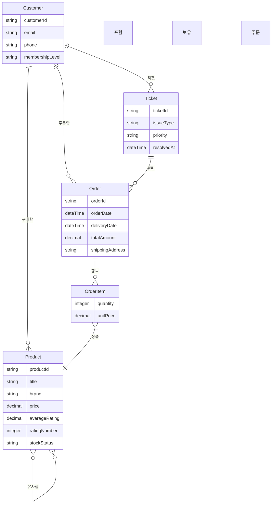
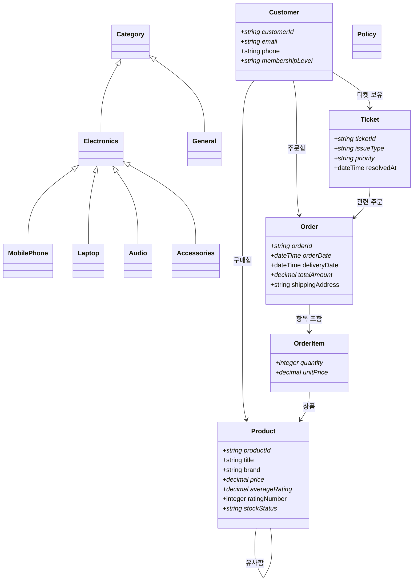

# E-Commerce 온톨로지 구조

## 개요

- **클래스 수**: 13
- **Object Property 수**: 16
- **Datatype Property 수**: 27

## 클래스 관계도 (ER Diagram)

## 클래스 상세도 (Class Diagram)

## 클래스 목록

| 클래스 | 한국어 | 부모 클래스 |
|--------|--------|-------------|
| `Accessories` | 액세서리 | Electronics |
| `Audio` | 오디오 | Electronics |
| `Category` | 카테고리 | - |
| `Customer` | 고객 | Person |
| `Electronics` | 전자제품 | Category |
| `General` | 일반 | Category |
| `Laptop` | 노트북 | Electronics |
| `MobilePhone` | 휴대폰 | Electronics |
| `Order` | 주문 | - |
| `OrderItem` | 주문 항목 | - |
| `Policy` | 정책 | - |
| `Product` | 상품 | Product |
| `Ticket` | 지원 티켓 | - |

## Object Property 목록

| 속성 | 한국어 | Domain → Range | 특성 |
|------|--------|----------------|------|
| `appliesTo` | 적용 대상 | Policy → Category | - |
| `belongsToOrder` | 소속 주문 | OrderItem → Order | 함수형, 역: containsItem |
| `containsItem` | 항목 포함 | Order → OrderItem | 역: belongsToOrder |
| `hasProduct` | 상품 | OrderItem → Product | 함수형, 역: isProductOf |
| `hasProduct_category` | 카테고리 상품 | Category → Product | 역: inCategory |
| `hasRelatedTicket` | 관련 티켓 | Order → Ticket | 역: relatedToOrder |
| `hasTicket` | 티켓 보유 | Customer → Ticket | 역: ticketOf |
| `inCategory` | 카테고리 소속 | Product → Category | 역: hasProduct_category |
| `isProductOf` | 주문 항목에 포함됨 | Product → OrderItem | 역: hasProduct |
| `orderedBy` | 주문자 | Order → Customer | 함수형, 역: placedOrder |
| `placedOrder` | 주문함 | Customer → Order | 역: orderedBy |
| `purchased` | 구매함 | Customer → Product | 역: purchasedBy |
| `purchasedBy` | 구매됨 | Product → Customer | 역: purchased |
| `relatedToOrder` | 관련 주문 | Ticket → Order | 역: hasRelatedTicket |
| `similarTo` | 유사함 | Product → Product | 대칭 |
| `ticketOf` | 티켓 소유자 | Ticket → Customer | 함수형, 역: hasTicket |

## Datatype Property 목록

| 속성 | 한국어 | Domain | Range | 함수형 |
|------|--------|--------|-------|--------|
| `address` | 주소 | * | string | - |
| `averageRating` | 평점 | Product | decimal | O |
| `brand` | 브랜드 | Product | string | - |
| `createdAt` | 생성일 | * | dateTime | - |
| `customerId` | 고객 ID | Customer | string | O |
| `deliveryDate` | 배송일 | Order | dateTime | - |
| `description` | 설명 | * | string | - |
| `email` | 이메일 | Customer | string | O |
| `issueType` | 문제 유형 | Ticket | string | O |
| `membershipLevel` | 회원 등급 | Customer | string | O |
| `name` | 이름 | * | string | - |
| `orderDate` | 주문일 | Order | dateTime | O |
| `orderId` | 주문 ID | Order | string | O |
| `phone` | 전화번호 | Customer | string | - |
| `price` | 가격 | Product | decimal | O |
| `priority` | 우선순위 | Ticket | string | O |
| `productId` | 상품 ID | Product | string | O |
| `quantity` | 수량 | OrderItem | integer | O |
| `ratingNumber` | 리뷰 수 | Product | integer | - |
| `resolvedAt` | 해결일 | Ticket | dateTime | - |
| `shippingAddress` | 배송 주소 | Order | string | - |
| `status` | 상태 | * | string | O |
| `stockStatus` | 재고 상태 | Product | string | O |
| `ticketId` | 티켓 ID | Ticket | string | O |
| `title` | 상품명 | Product | string | - |
| `totalAmount` | 총액 | Order | decimal | O |
| `unitPrice` | 단가 | OrderItem | decimal | O |