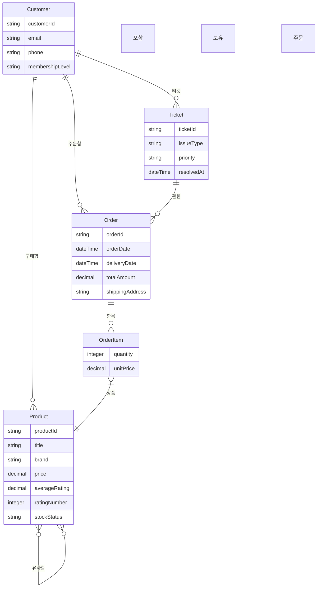

```mermaid
erDiagram
    Customer {
        string customerId
        string email
        string phone
        string membershipLevel
    }
    Product {
        string productId
        string title
        string brand
        decimal price
        decimal averageRating
        integer ratingNumber
        string stockStatus
    }
    Order {
        string orderId
        dateTime orderDate
        dateTime deliveryDate
        decimal totalAmount
        string shippingAddress
    }
    OrderItem {
        integer quantity
        decimal unitPrice
    }
    Ticket {
        string ticketId
        string issueType
        string priority
        dateTime resolvedAt
    }

    Customer ||--o{ Product : 구매함
    Customer ||--o{ Order : 주문함
    Order ||--o{ OrderItem : 항목 포함
    OrderItem }|--|| Product : 상품
    Product }o--o{ Product : 유사함
    Customer ||--o{ Ticket : 티켓 보유
    Ticket ||--o{ Order : 관련 주문
```